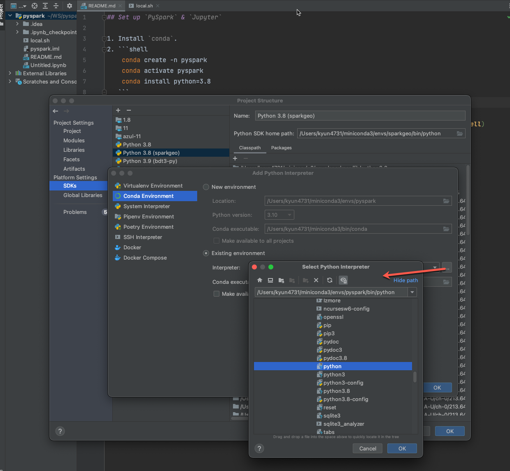

This repo is to show you how to set up Jupyter Notebook with PySpark.

## Set up
- Install Java.
- Download [Apache Spark](https://spark.apache.org/downloads.html).
- `.bash_profile` must look like this.
    ```bash
    export JAVA_HOME=$(/usr/libexec/java_home -v 1.8.0_271)
    export SPARK_HOME=/usr/local/spark-3.2.0-bin-hadoop3.2
    export PATH=${PATH}:$JAVA_HOME/bin:$SPARK_HOME/bin
    ```
- Create a conda environment.
    ```shell
    conda env remove -n pyspark
    conda create -n pyspark
    conda activate pyspark
    conda install -c conda-forge jupyterlab
    ```
- Start pyspark which will start jupyterlab.
    ```shell
    # Set SPARK_HOME to switch to different versions.
    export SPARK_HOME='/usr/local/spark-3.2.1-bin-hadoop3.2'
    export PYSPARK_DRIVER_PYTHON=jupyter
    export PYSPARK_DRIVER_PYTHON_OPTS='lab --ip=0.0.0.0 --port 8888 --allow-root --no-browser --NotebookApp.token=""'
    
    ${SPARK_HOME}/bin/pyspark\
      --master local[*]\
      --conf spark.driver.memory=31G\
      --conf spark.ui.enabled=true\
      --conf spark.ui.showConsoleProgress=true\
      --conf spark.sql.catalogImplementation=in-memory\
      --conf spark.sql.execution.arrow.pyspark.enabled=true\
      --conf spark.memory.offHeap.size=31G\
      --conf spark.memory.offHeap.enabled=true\
      --conf spark.kryo.unsafe=true\
      --conf spark.serializer=org.apache.spark.serializer.KryoSerializer\
      --conf spark.submit.pyFiles='bdt-3.0.0+snapshot-py3.10.egg'\
      --conf spark.jars='bdt-3.0.0-3.2.0-2.12-SNAPSHOT.jar'
    ```
- (Optional) In IntelliJ, add python SDK.
   

## Set up that doesn't work
I couldn't figure out how to set up pyspark installed from the conda-forge with jupyter notebook 
and `without` the full spark from [here](https://spark.apache.org/downloads.html).
The following instruction `doesn't` work.
```shell
conda create -n pyspark
conda activate pyspark
conda install -c conda-forge pyspark=3.2.1 jupyterlab
```
```shell
export PYSPARK_DRIVER_PYTHON=jupyter
export PYSPARK_DRIVER_PYTHON_OPTS='notebook'
pyspark --master local[*]
```

## TODO
- Set up for `local-cluster` and `spark://`.
- Try `spark.pyspark.python`, `spark.pyspark.driver.python`

## References

- [To use the Jupyter,](https://spark.apache.org/docs/latest/rdd-programming-guide.html#using-the-shell)
   ```shell
   $ PYSPARK_DRIVER_PYTHON=jupyter PYSPARK_DRIVER_PYTHON_OPTS=notebook ./bin/pyspark
   ```
   You can customize the `jupyter` commands by setting `PYSPARK_DRIVER_PYTHON_OPTS`.

- https://spark.apache.org/docs/latest/rdd-programming-guide.html#using-the-shell
- https://spark.apache.org/docs/latest/configuration.html#environment-variables